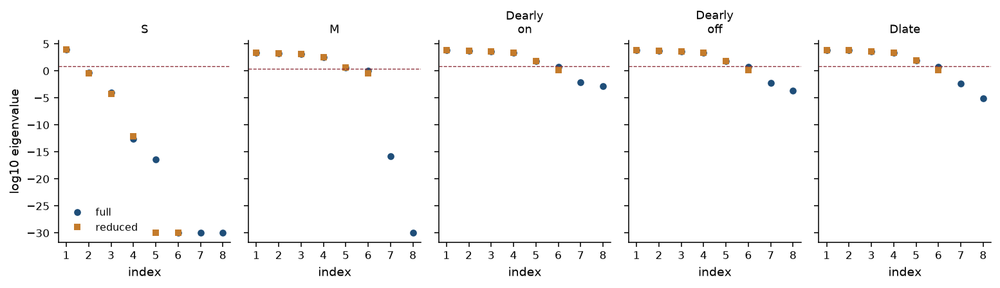
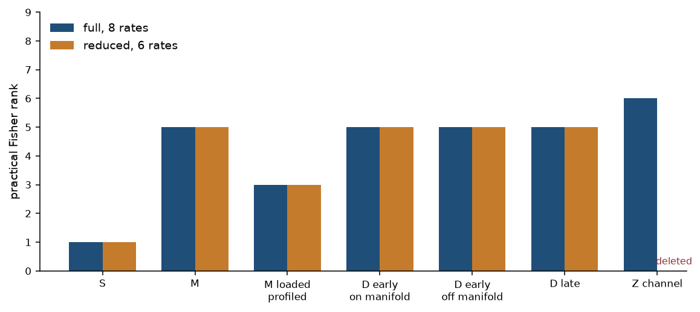
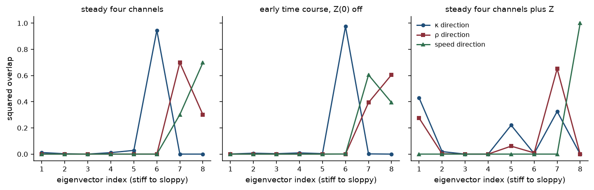
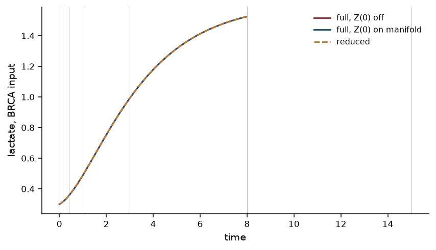
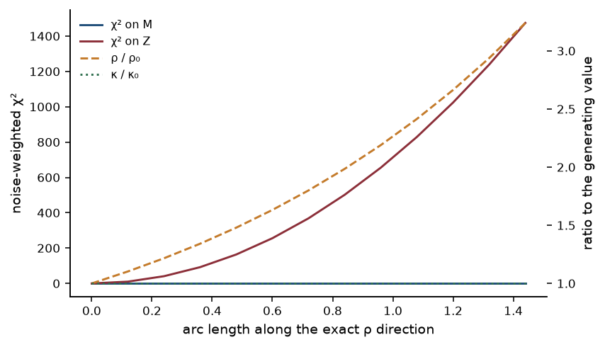

# Reduction-preserving multi-channel identifiability: which Fisher ranks survive a stiff–sloppy reduction?

**Thesis #24. Computational research thesis**  
**Depends on:** Thesis #9 (multi-channel metabolic ODE identifiability) and Thesis #12 (stiff–sloppy / MBAM-style reduction)  
**Author:** Kelechi Emeka Ogbonna  
**Correspondence:** kelechiogbonna300@gmail.com · https://github.com/cloudynirvana/thesis-24-reduction-preserving-multichannel-id  
**Date:** 21 September 2026  
**Format:** B.Sc. project chapters (Nile University style), written as a computational methods manuscript  
**Status:** Seeded Fisher ranks on one declared metabolic generator, before and after a documented quasi-steady reduction. Synthetic inputs. Not a cell-line fit.  
**Citation style:** numbered Vancouver. A `doi:` field appears only where Crossref returned the record.  
**DOI:** none for this document. Do not invent one.

---

## Title page

**REDUCTION-PRESERVING MULTI-CHANNEL IDENTIFIABILITY: WHICH FISHER RANKS SURVIVE A STIFF–SLOPPY REDUCTION?**

BY

**KELECHI EMEKA OGBONNA**

A COMPUTATIONAL RESEARCH THESIS  
(IN-SILICO FISHER RANKS ON A FULL METABOLIC ODE AND ON ITS QUASI-STEADY REDUCTION)

SUBMITTED AS A CITEABLE MANUSCRIPT FOR JOURNAL / THESIS HANDOFF

PROJECT CONFLUENCE  
INDEPENDENT COMPUTATIONAL RESEARCH

SUPERVISOR: not appointed for this deposit

SEPTEMBER 2026

---

## Declaration

I, Kelechi Emeka Ogbonna, declare that this computational research thesis was carried out by me. The ranks, spectra, walks, and chi-square values reported here were produced by `sim/reduction_ranks.py` at seed 20260921. They are not wet-lab measurements and not patient outcomes. No DOI, ORCID, or journal acceptance was invented for this document. Thesis #9 and Thesis #12 are cited as prior deposits. Their numerical ranks are not copied into Chapter Four.

_________________________     _______________________  
Kelechi Emeka Ogbonna         Date

---

## Abstract

After a documented stiff–sloppy or MBAM-style reduction, which multi-channel Fisher ranks from the full metabolic ODE survive on the reduced system, and which ranks are artefacts of the unreduced coordinates?

The generator is an eight-rate extension of a four-metabolite cancer ODE. Glucose, pyruvate, lactate and a glutamine-linked pool are observed. A fast modifier Z multiplies the lactate branch through the product κ = h a / b. The documented reduction slaves Z, keeps κ as one coordinate, and deletes the separate rates a, b and h. The same channel schedules are then ranked again. Practical rank means an eigenvalue above 10−3 times the leading eigenvalue. Numerical rank uses 10−8. Both cuts were fixed before the spectra were read.

On the shared schedules the practical ranks survive. The steady lactate/glucose ratio has practical rank 1 of 8 on the full vector and 1 of 6 on the reduced vector. The four-channel steady snapshot has practical rank 5 of 8 and 5 of 6. The multi-channel advantage, 5 − 1 = 4, is unchanged. A lineage loading, profiled out, leaves practical rank 3 on both vectors. Early and late time courses of the same four channels also stay at practical rank 5. The product κ itself remains below the practical cut on every shared schedule. It is a real reduced coordinate, and it is sloppy both before and after the reduction.

Two ranks do not survive. The schedule that also records steady Z has practical rank 6 of 8. The reduced field has no Z, so that rank is flagged as vanished. Its leading eigenvector carries squared overlap 0.430 with the κ axis and 0.275 with the ρ = a/b axis. The speed of Z remains an exact null even on that schedule. Separately, the time courses carry one or two extra numerical eigenvalues in the (ρ, speed) plane, at 10−6 to 10−8 of the leading eigenvalue. Those numerical ranks fall after reduction (7 to 6 on the late grid; 8 to 6 on the early grid). They never cleared the practical cut. A walk along the exact ρ direction multiplies ρ by 3.241, leaves κ and the four-channel chi-square unchanged, and raises the Z-channel chi-square to 1474.6. Spending ρ as an extra clearance of the glutamine-linked pool shifts that pool by −1/7, leaves the ratio chi-square at 0, and produces four-channel chi-square 26.50.

The draws are a synthetic surrogate. Research only. Not a medical device, not clinical decision support, not a dose, and not a cure.

---

## Keywords

Fisher information; practical identifiability; multi-channel observation; model reduction; manifold boundary approximation; quasi-steady state; sloppy models; cancer metabolism; synthetic data; research only

---

## Table of Contents

DECLARATION  
ABSTRACT  
Table of Contents  
List of tables and figures  

CHAPTER ONE. INTRODUCTION  
1.1 Background to the study  
1.2 STATEMENT OF RESEARCH PROBLEM  
1.3 JUSTIFICATION OF STUDY  
1.4 AIM AND OBJECTIVES OF THE STUDY  
1.5 SIGNIFICANCE OF THE STUDY  
1.6 SCOPE OF THE STUDY  

CHAPTER TWO. LITERATURE REVIEW  
2.1 A metabolic snapshot is an observation map  
2.2 Rank of the Fisher information  
2.3 Stiff directions, sloppy directions, and a boundary reduction  
2.4 What a quasi-steady step deletes  
2.5 Ranks that this thesis does not inherit  

CHAPTER THREE. MATERIALS AND METHODS  
3.1 Design, and the order of the calculation  
3.2 The full field and the two combinations  
3.3 The reduced field  
3.4 Channel schedules  
3.5 Fisher matrices, cuts, and flags  
3.6 A null walk and a bad edit  
3.7 What was not done  

CHAPTER FOUR. RESULTS  
4.1 The steady map, and an exact reduction at steady state  
4.2 The ratio rank survives  
4.3 The four-channel advantage survives, and κ stays sloppy  
4.4 A lineage loading does not create a rank that the reduction then destroys  
4.5 Time courses: practical rank survives, numerical rank in the unreduced plane does not  
4.6 The Z channel has no reduced counterpart  
4.7 The ρ direction is flat on the shared maps and expensive if it is renamed  
4.8 Checks  

CHAPTER FIVE. DISCUSSION, CONCLUSION AND RECOMMENDATION  
5.1 Discussion  
5.2 Conclusion  
5.3 Recommendation  

REFERENCES  
DISCLAIMER  

---

## List of tables and figures

**Table 3-1.** Generating rates and the two combinations.  
**Table 3-2.** Channel schedules applied to both fields, and the one schedule the reduction deletes.  
**Table 3-3.** Cuts and flag rules, fixed before the spectra were read.  
**Table 4-1.** Steady state at the generating rates.  
**Table 4-2.** Practical and numerical Fisher ranks, full against reduced.  
**Table 4-3.** Squared participation of the steady four-channel eigenvectors.  
**Table 4-4.** Null walk and the edit that spends ρ.

**Figure 4-1.** Log-eigenvalue spectra of the shared schedules.  
**Figure 4-2.** Practical ranks.  
**Figure 4-3.** Squared overlap with the analytic axes.  
**Figure 4-4.** Walk along the exact ρ direction.  
**Figure 4-5.** Lactate under the full field and the reduced field.

Figures are diagnostics from `sim/reduction_ranks.py`. They are not measured metabolite panels.

---

# CHAPTER ONE

## 1.0 INTRODUCTION

### 1.1 Background to the study

Incidence figures give a reason to write cancer models. They do not supply rate constants. GLOBOCAN 2022, published in 2024, estimates incidence and mortality for 36 cancers in 185 countries [1]. The later hallmark list places reprogramming of metabolism next to proliferation and death [2]. Warburg’s description of aerobic glycolysis is the old observation behind that heading [3]. Modern accounts treat the same observation as a biosynthetic requirement of proliferation, not as a single damaged enzyme [4–8].

The data objects that sit next to those accounts are large. The Cancer Cell Line Encyclopedia began as a drug-response and genomic panel [9,10]. A later release mapped metabolite abundances across the same lines [11]. Metabolomics and isotope tracing are how a laboratory actually sees a pathway [12]. Mathematical oncology has its own library of ordinary differential equations for burden, quiescence, and treatment [13]. A metabolite panel and a burden curve are different observation maps. A rank computed on one does not travel to the other by vocabulary.

Thesis #9 asked a narrow question of one shared metabolic ODE. Can glucose, pyruvate, lactate and a glutamine-linked pool, read at steady state, identify the rates, or does the map collapse [14]? On that generator a steady lactate/glucose ratio had Fisher rank 1 of 5. A four-channel snapshot, after lineage loadings were profiled out, had rank 4 of 5. The missing direction was a common rescaling of the rates. Those integers belong to that vector field and that noise model. They are cited here. They are not recomputed as if they were the present generator.

A second line of work asks what remains after a high-dimensional parameter space has been compressed. Gutenkunst and co-authors found, across seventeen systems-biology models, a few stiff directions and then eigenvalues that fall by orders of magnitude [15]. The data pin combinations. Thesis #12 took that geometry onto a ten-rate cancer-state toy and asked which directions were sloppy under two observation maps, and whether a documented reduction could keep a gated claim without renaming a leftover combination as a mechanism [16]. Transtrum and Qiu had already stated the reduction rule: follow the canyon of the cost to the boundary of the model manifold, drop the combination that has become irrelevant, and keep a vector field whose predictions still match the data that justified the reduction [17]. On the Thesis #12 toy, a quasi-steady stress reduction that kept one product reproduced the gated claim. An edit that spent a null coordinate on a new term did not.

The gap between those two deposits is the present question. Thesis #9 ranks multi-channel maps on a full metabolic ODE. Thesis #12 reduces a different ODE and refuses to rename sloppy combinations. Nobody in those deposits asked whether the multi-channel rank gains still hold after the reduction, or whether some of the gains were ranks of coordinates the reduction deletes. That question has to be answered before a reduced metabolic model is used to design an observation. The 2022 Nile University wet-lab project on *Carica papaya* leaf-extract silver nanoparticles is a separate study [18]. Its assay numbers are not inputs to this generator.

### 1.2 STATEMENT OF RESEARCH PROBLEM

After a documented stiff–sloppy or MBAM-style reduction, which multi-channel Fisher ranks from the full metabolic ODE survive on the reduced system, and which ranks are artefacts of the unreduced coordinates?

The working form is local and finite. Eight positive rates are fixed at one generating point. One fast modifier is added to the metabolic field so that a quasi-steady product is available to delete, in the sense of Thesis #12, without leaving the metabolite list of Thesis #9. The same schedules are applied to the eight-rate vector and to the six-rate reduced vector. A rank survives when the practical integer is unchanged. A rank vanishes when the reduced integer is smaller, or when the schedule uses a state the reduction has deleted. An eigenvalue is an artefact of the unreduced coordinates when its eigenvector lies in the plane orthogonal to that product and the reduced spectrum has no counterpart.

The question is about this generator, these schedules, and these two cuts [14–17]. It is not a census of metabolic models, and it is not a claim that any coordinate in Table 3-1 was measured in a cell line.

### 1.3 JUSTIFICATION OF STUDY

Observation design for an ODE is a statement about an output map. Cobelli and DiStefano separated the structural content of that map from the numerical trouble of a finite sample [19]. Raue and colleagues made the same separation operational with the profile likelihood: a direction can be locally flat even when a point estimate has been printed [20]. If the map is changed by a reduction, the rank has to be computed again. A sentence that carries the full-model rank onto the reduced model, because the channels have the same names, skips that computation.

Sloppy geometry makes the skip expensive. White and colleagues showed how experimental design and point estimates behave when sloppy directions are treated as ordinary parameters [21]. A channel can look informative because it moves a coordinate that a later reduction will throw away. The reduced model is then asked to support an observation-design claim that lived entirely in the deleted coordinate. The converse failure is also available. A reduction can be blamed for destroying a multi-channel advantage that in fact sat in the stiff block and was never about the deleted rates.

Saltelli and colleagues ask models to expose the assumptions a number depends on [22]. May’s warning is the same demand, aimed at biology that borrows equations more readily than it audits them [23]. The audit here is small. One generator. Two parameter vectors. The schedules of Chapter Three. A table that flags each integer.

The study is not justified as a device, a dosing rule, or a metabolomic biomarker [22,23].

### 1.4 AIM AND OBJECTIVES OF THE STUDY

The aim is to re-rank the channel schedules of one metabolic ODE after a documented stiff–sloppy reduction, and to flag the ranks that do not survive.

The objectives are:

1. Integrate the eight-rate field and the six-rate quasi-steady field at one generating point, and record the steady metabolites.
2. Compute the Fisher spectrum of each shared schedule on both parameter vectors, in log-rates, at the cuts in Section 3.5.
3. Compare practical rank and numerical rank, and flag each schedule.
4. Repeat the steady four-channel calculation with a lineage loading, and profile the loading out.
5. Add the schedule that records the modifier, which the reduced field cannot host.
6. Walk the exact null direction that changes ρ = a/b at fixed κ, and record the chi-square on the shared maps and on the modifier.
7. Spend ρ as an extra clearance and record which schedules move.
8. Keep the synthetic label on every numerical claim.

Non-aims. Fitting the rates to a CCLE file. Re-deriving the integers of Thesis #9 or Thesis #12 on this vector field and calling them a replication. A global identifiability certificate. A Christoffel geodesic. A dose.

### 1.5 SIGNIFICANCE OF THE STUDY

The useful product is a separation that an observation-design paragraph can lose. A practical rank that lives in the five metabolic rates is a property of the reduced model as well as of the full model. A practical rank that requires the deleted modifier is not. A numerical eigenvalue that sits in the unreduced plane, and that never clears the practical cut, is a third object: it will inflate a rank only if the cut is ignored.

On this generator the multi-channel advantage of the four steady channels over the ratio survives the reduction, and the modifier channel does not have a reduced rank at all. That pair of facts is the reason to re-rank after a reduction rather than to inherit a rank from the unreduced coordinates [17,20].

What the significance is not: a survival difference, a cell-line classification, or a reason to treat a tumour [1,22].

### 1.6 SCOPE OF THE STUDY

In scope. The five-state field of Section 3.2 and the four-state reduction of Section 3.3. Eight positive rates at one point, and the six-rate image of that point. Known inputs. Known initial conditions. Gaussian Fisher information of the mean. The schedules in Table 3-2. The cuts in Table 3-3. One exact null walk. One bad edit. One seeded noise draw, used only as a check that the ρ direction stays flat.

Out of scope. A download of CCLE, DepMap, or any metabolite table [9–11]. The ten-rate field of Thesis #12, and the five-rate field of Thesis #9, as objects to be re-integrated. Patient samples. A global structural-identifiability run of the sort DAISY implements [24]. A geodesic with Christoffel symbols [17]. Regulatory use. The wet-lab measurements of the 2022 project [18].

---

# CHAPTER TWO

## 2.0 LITERATURE REVIEW

### 2.1 A metabolic snapshot is an observation map

The Warburg effect is often written as a phenotype. The papers that made it a research programme are more specific. They argue about biosynthetic demand, about which fuels a proliferating cell actually uses, and about how a pathway is inferred from labelling [4–8,12]. Glutamine belongs in that argument because the carbon and nitrogen budgets are not closed by glucose alone [25]. None of those papers is a Fisher matrix.

A cell-line panel makes the observation concrete and still does not identify a rate. Barretina and colleagues built the original encyclopedia for drug response [9]. Ghandi and colleagues extended the molecular annotation [10]. Li and colleagues reported the metabolite abundances [11]. Jang, Chen and Rabinowitz describe what an isotope experiment can and cannot say about a flux [12]. An ordinary differential equation can be placed next to those data only after someone names the output map. Thesis #9 named three maps on one right-hand side: a ratio, a loaded snapshot, and a short time course used as an upper bound [14]. The present schedules keep that menu and add the modifier channel that a reduction will delete.

Mathematical oncology has tended to score a model by the shape of a burden curve [13]. Benzekry and colleagues had already shown, on growth laws, that the preferred curve depends on the series. That comparison is not repeated here. The point carried forward is narrower. The output map is part of the model. Changing it, or deleting a state that only one map could see, is a change of the scientific object [19].

### 2.2 Rank of the Fisher information

Structural identifiability, in the sense of Bellman and Åström, asks whether the input–output map determines the parameters in the absence of noise [26]. Cobelli and DiStefano reviewed the ambiguities that survive even that idealisation, including combinations that no experiment of a given class can split [19]. Jacquez and Greif joined the structural question to estimability and to sampling design [27]. Global tests exist; Villaverde, Barreiro and Papachristodoulou compared differential-algebra and other structural tests on systems-biology models [28]. Ljung and Glad gave a rank condition for global identifiability of a parametric structure [29]. DAISY is one implementation of a differential-algebra test [24]. None of those certificates is computed in Chapter Four. The object here is the local Gaussian Fisher matrix at one point.

Practical identifiability is the finite-sample version. Raue and colleagues used the profile likelihood to show that a structurally admissible parameter can still be unbounded in a realistic experiment [20]. Wieland and colleagues restated the distinction for a systems-biology audience [30]. Eisenberg and Hayashi showed how subset profiling finds the combinations that remain when single coordinates do not [31]. Miao, Xia, Perelson and Wu reviewed the nonlinear ODE case with viral dynamics as the worked setting [32]. Kreutz, Raue, Kaschek and Timmer treated the profile as a standard tool rather than as a special case [33]. A later comparison by Raue and colleagues found that structural and practical answers diverge in predictable ways when the observation is short or partial [34].

The integer used below is a threshold on the eigenvalues of the Fisher matrix, not a profile. A profile would ask how far one coordinate can move. The eigenvalue asks how many directions, in the log-rate metric, the schedule can see at the generating point. Both are local. The eigenvalue is the one that can be compared, schedule by schedule, before and after a reduction of the parameter vector. Where a single eigenvalue sits near the cut, the spectrum is reported beside the integer [20,30].

### 2.3 Stiff directions, sloppy directions, and a boundary reduction

Gutenkunst and co-authors plotted the sensitivity eigenvalues of seventeen models and found the same shape: a few large eigenvalues, then a fall of many decades [15]. Waterfall and co-authors related that shape to a Vandermonde structure in the sensitivities [35]. Brown and Sethna had already treated models with many poorly known parameters as a statistical-mechanical problem [36]. The geometry of the cost came next. Transtrum, Machta and Sethna described nonlinear least squares as a canyon, long in some directions and thin in others [37]. An optimiser can travel a long way in log-parameters and return a cost that has barely moved. Machta, Chachra, Transtrum and Sethna argued that this compression is why a low-dimensional effective theory can predict while most microscopic parameters stay loose [38]. The perspective that followed put the same fact across physics and biology [39]. Quinn and colleagues reviewed the information geometry behind that simplicity [40].

The reduction rule that uses the canyon is the manifold boundary approximation method. Transtrum and Qiu follow the sloppy direction until a combination hits a boundary, drop it, and keep the predictions that the data constrained [17]. A later paper distinguishes that inheritance from a phenomenological model discovered afresh [41]. Apgar, Witmer, White and Tidor showed that sloppiness changes what an experiment can be asked to identify, and that design has to aim at the stiff combinations [42]. White and colleagues pressed the same point onto parameter estimates that look precise only because the sloppy directions were frozen [21].

Thesis #12 applied this geometry to one cancer-state toy [16]. Bulk burden had practical Fisher rank 3 of 10. A split of proliferating, quiescent and apoptotic cells had practical rank 6 of 10. The trailing eigenvectors of the richer map lay nearly on the level set of one stress product. A quasi-steady reduction that kept the product reproduced the gated claim at relative error 0.0070. A flow along a sloppy eigenvector moved an apoptosis rate by a large factor at a negligible chi-square. The present reduction is the same kind of step, on a metabolic field: keep the product the steady map can see, delete the coordinates it cannot, and do not give the deleted coordinates a new biological name.

Daniels and Nemenman search a space of simple right-hand sides and return a phenomenological law [43]. That product is discovered from data. The product in Chapter Three is inherited. κ is already the combination in the steady equations. The reduction names it and stops.

### 2.4 What a quasi-steady step deletes

The pseudo-steady-state hypothesis is old, and its mathematical status was never “the fast variable does not matter.” Heineken, Tsuchiya and Aris set the hypothesis inside a singular perturbation and showed which terms survive [44]. Segel and Slemrod used the Michaelis–Menten reduction as the case study: the quasi-steady equation is a different vector field, valid on a timescale the fast transient has already left [45]. The deleted object is the approach to the slow manifold, together with any parameter that appears only in that approach.

On the field below, Z is that fast variable. At steady state, Z = (a/b) P, and the lactate branch depends on Z only through κ = h a / b. Two directions in (log a, log b, log h) hold κ fixed. One of them also holds ρ = a/b fixed and changes only the speed. The other changes ρ. A steady observation of glucose, pyruvate, lactate and the pool is blind to both. A steady observation of Z can see ρ. A transient observation can, in principle, see the speed. Whether those directions clear a practical cut is a calculation, not a consequence of the algebra. Section 4.5 and Section 4.6 are that calculation.

The reduced field is not the full field with three rates crossed out. It is a four-state equation in which κ is a coordinate. Eigenvalues of the eight-by-eight Fisher matrix and eigenvalues of the six-by-six matrix are comparable as integers of rank. They are not the same list. The chain rule multiplies the κ eigenvalue by the squared length of the embedding (1, −1, 1), which is 3, up to the mixing of κ with the metabolic rates. Chapter Four reports that factor rather than treating a threefold shift as a discrepancy.

### 2.5 Ranks that this thesis does not inherit

Thesis #9 reported rank 1 of 5 for the ratio and profiled rank 4 of 5 for the loaded snapshot, on a linear five-rate field whose ratio did not depend on the input [14]. The field in Section 3.2 is nonlinear in the modifier. The ratio depends on the input. The parameter count is eight, then six. A reader who pastes 1-of-5 or 4-of-5 into Table 4-2 is using the wrong generator.

Thesis #12 reported practical ranks 3 of 10 and 6 of 10, and a claim error of 0.0070, on a burden model with an unobserved stress variable [16]. That model is not integrated here. The shared inheritance is the reduction rule and the refusal to rename a null coordinate [17,41].

Lineage loadings are a different ambiguity. Leek and colleagues documented how batch structure in high-throughput data can dominate a biological contrast [46]. Thesis #9 put one loading per synthetic lineage on the log concentrations and profiled it out [14]. The same construction is repeated in Section 3.4, with the correlation matrix declared again so that this deposit can be read alone. The loadings are a nuisance for the kinetic rank. They are not a batch estimate from a repository.

Brady and Enderling asked when a cancer model is the wrong object from which to announce a therapy, even after a successful fit [47]. Their warning is about prediction under intervention. The warning here is about a rank transferred across a reduction. Both warnings end in the same place if the rank is then used to justify a dose. That use is outside this deposit [22,23].

---

# CHAPTER THREE

## 3.0 MATERIALS AND METHODS

### 3.1 Design, and the order of the calculation

The order is fixed. Write the full field. Name the product a quasi-steady reduction is allowed to keep. Rank every schedule on the full log-rate vector. Rank the same schedules on the reduced vector. Flag the integers. Only then read a walk along a null direction, and only then insert the bad edit.

The inputs are four named pairs (uG, uQ). The names BRCA, LUAD, COAD and AML, and the values of the inputs, are the synthetic schedule of Thesis #9 [14]. They are labels for known forcings. They are not rows of a CCLE file, and no metabolite table was downloaded [9–11]. The correlation matrix on the four log concentrations is the same declared matrix as in that deposit, copied here so the noise model is inspectable without opening the other repository.

The Fisher matrices are noise-free. They are the Gaussian information of the mean. Seed 20260921 is used for one noisy panel in Section 4.8 and for nothing else. Regenerating `sim/reduction_ranks.py` rewrites `sim/results.json` and `sim/figures/`.

### 3.2 The full field and the two combinations

The states are glucose G, pyruvate P, lactate L, a glutamine-linked pool Q, and a modifier Z. The rates are positive. At the generating point,

θ = (kgp, kpl, kpq, dl, dq, a, b, h) = (0.80, 0.50, 0.30, 0.40, 0.60, 1.60, 8.00, 0.45).

The vector field is

dG/dt = uG − kgp G

dP/dt = kgp G − (kpl (1 + h Z) + kpq) P

dL/dt = kpl (1 + h Z) P − dl L

dQ/dt = uQ + kpq P − dq Q

dZ/dt = a P − b Z.

Two combinations organise the reduction.

ρ = a / b, &nbsp;&nbsp; κ = h a / b = h ρ.

At the generating point, ρ = 0.200 and κ = 0.090. The time constant of Z is 1/b = 0.125. Table 3-1 lists the rates.

**Table 3-1.** Generating rates. κ and ρ are reported combinations, not extra free inputs.

| Symbol | Value | Role in the field |
| --- | --- | --- |
| kgp | 0.80 | Glucose consumption |
| kpl | 0.50 | Pyruvate-to-lactate coefficient |
| kpq | 0.30 | Pyruvate into the pool |
| dl | 0.40 | Lactate clearance |
| dq | 0.60 | Pool clearance |
| a | 1.60 | Production of Z |
| b | 8.00 | Clearance of Z |
| h | 0.45 | Gain of Z on the lactate branch |
| ρ = a/b | 0.200 | Steady Z/P |
| κ = h a/b | 0.090 | Product kept by the reduction |

The steady state of (G, P, L, Q) solves a quadratic in P. With A = kpl κ and B = kpl + kpq,

A P2 + B P − uG = 0,

and the positive root is used. Then G = uG / kgp, L = kpl (1 + κ P) P / dl, Q = (uQ + kpq P) / dq, and Z = ρ P. The first four steady values depend on the five metabolic rates and on κ. They do not depend on how κ is split among a, b and h.

In log-rate coordinates the differential of log κ is d log a − d log b + d log h. An orthonormal frame for the (a, b, h) block is used to read eigenvectors:

eκ = (1, −1, 1) / √3,

espeed = (1, 1, 0) / √2,

eρ = (1, −1, −2) / √6.

The speed axis holds both κ and ρ fixed. It changes only how fast Z approaches ρ P. The ρ axis holds κ fixed and changes ρ. Any steady functional of (G, P, L, Q) is invariant under both axes. A steady functional of Z is invariant under the speed axis and moves under the ρ axis.

### 3.3 The reduced field

The reduction deletes Z as a state and keeps κ as a parameter. The states are (G, P, L, Q). The parameter vector is

φ = (kgp, kpl, kpq, dl, dq, κ),

with κ fixed at 0.090 when the full generating point is pushed forward. The vector field is

dG/dt = uG − kgp G

dP/dt = kgp G − kpl (1 + κ P) P − kpq P

dL/dt = kpl (1 + κ P) P − dl L

dQ/dt = uQ + kpq P − dq Q.

This is the MBAM-style step in miniature. The combination the steady metabolite map can see is kept and named. The two directions that do not move that map are not given a new reaction [17,41,45]. At steady state the reduced algebraic map is the full algebraic map. The script refuses to continue if the maximum absolute gap on (G, P, L, Q) exceeds 10−9. The realised gap is 0 within floating-point comparison of the two closed forms.

The transients are not the same object. The reduced field starts on the slow relation. The full field starts at a declared Z(0) and has an initial layer of duration about 0.125. Section 4.5 measures that layer in the observed logs.

### 3.4 Channel schedules

Every shared schedule uses the same four inputs. The input values are BRCA (1.00, 0.40), LUAD (1.40, 0.55), COAD (0.80, 0.50) and AML (1.20, 0.30), in the order (uG, uQ).

**Table 3-2.** Schedules. “Reduced” means the six-rate field can be observed under that schedule.

| Code | What is recorded | Noise | Replicates | On the reduced field |
| --- | --- | --- | --- | --- |
| S | Steady log(L/G) | σ = 0.08, independent | 6 | yes |
| M | Steady log G, P, L, Q | σ = 0.15, correlation below | 6 | yes |
| Mβ | M, plus one loading per lineage | same as M | 6 | yes |
| D early | log G, P, L, Q at t = 0.05, 0.15, 0.40, 1, 3, 8, 15 | σ = 0.10, independent | 4 | yes |
| D late | same channels at t = 1, 2, 4, 8, 15 | σ = 0.10, independent | 4 | yes |
| Z | Steady log G, P, L, Q, Z | σ = 0.15, independent | 6 | no |

The correlation on (log G, log P, log L, log Q) is

Corr = [[1, 0.55, 0.45, 0.15], [0.55, 1, 0.60, 0.20], [0.45, 0.60, 1, 0.10], [0.15, 0.20, 0.10, 1]].

The covariance is σ2 Corr with σ = 0.15. The matrix is synthetic [14,46]. It is not an estimated batch effect.

For Mβ the loading βi is added to all four log concentrations of lineage i. The joint Fisher matrix treats the rates in the log chart and the loadings in the natural chart. The kinetic block is then the Schur complement that profiles the loadings out [20,31].

Initial conditions for the time courses are (G, P, L, Q) = (1.20, 0.40, 0.30, 0.50). On the full field, D early is run twice: Z(0) = 0.02, off the manifold, and Z(0) = ρ P(0) = 0.080, on it. D late uses Z(0) = 0.02. By t = 1 the factor e−b t is e−8, so the layer has died before the late grid begins. The reduced time courses have no Z(0). The observation list is still the four metabolites. A difference between “on manifold” and “off manifold” is a difference in a hidden initial condition, not a difference in the channel list.

Schedule Z records the modifier the reduction deletes. There is no reduced Fisher matrix for it. That absence is the flag, not a missing run.

### 3.5 Fisher matrices, cuts, and flags

Sensitivities are central differences in the log-rates. The step is 10−6 for steady schedules and 10−4 for time courses. If μ(θ) is the stacked noise-free prediction and W is the whitening matrix that already includes the replicate weight, the Fisher matrix is (W J)T (W J), symmetrised. For S, D early, D late and Z, W is a scalar times the identity. For M and Mβ, W is block diagonal, one whitened 4×4 block per lineage.

Eigenvalues are ordered from largest to smallest. With λmax the leading eigenvalue,

practical rank = # { λi / λmax &gt; 10−3 },

numerical rank = # { λi / λmax &gt; 10−8 }.

These fractions are the cuts of Thesis #9 and Thesis #12 [14,16]. They were written into the script before the spectra in Chapter Four were inspected. Table 3-3 states the flags.

**Table 3-3.** Flag rules.

| Object | Survives | Vanishes |
| --- | --- | --- |
| Practical rank of a shared schedule | The two integers are equal | The reduced integer is smaller |
| Numerical rank of a shared schedule | The two integers are equal | The reduced integer is smaller |
| Schedule Z | — | The reduced field has no Z |
| Multi-channel advantage r(M) − r(S) | The difference is unchanged and positive | The reduced difference is 0 |

A diagnostic, not a second cut, records the squared mass of each full-model eigenvector on the five metabolic rates plus eκ. Mass on span{eρ, espeed} is the unreduced plane. The integer flags in Table 4-2 do not depend on this mass. The mass is how a vanished numerical eigenvalue is identified as an unreduced coordinate rather than as a metabolic rate that became harder to see.

### 3.6 A null walk and a bad edit

The walk moves the full parameter along eρ in log space, arc length 0.12 per step, for 12 steps. κ is an invariant of that axis. The steady (G, P, L, Q) map is an invariant. Z is not. At each point the script stores κ, ρ, and the noise-weighted chi-square of schedules S, M and Z against the generating mean.

The bad edit keeps the full steady relations for G, P, L and Z, and replaces the pool clearance dq by dq + γ ρ with γ = 0.50. At the generating point the extra clearance is 0.10. The edit is the act Thesis #12 refused: a coordinate that the shared steady map cannot see is written into an equation and treated as a mechanism [16,17]. The chi-square of the edited mean against the original mean is recorded on S and on M.

### 3.7 What was not done

No CCLE or DepMap file was read [9–11]. No parameter was optimised to a measurement. The profile likelihood was not traced; the near-cut eigenvalues are reported as eigenvalues [20]. Christoffel symbols were not formed [17]. DAISY was not run [24]. The five-rate field of Thesis #9 and the ten-rate field of Thesis #12 were not re-integrated [14,16]. The wet-lab α-amylase numbers of the 2022 project were not used [18].

---

# CHAPTER FOUR

## 4.0 RESULTS

### 4.1 The steady map, and an exact reduction at steady state

Table 4-1 is the steady state at θ. The reduced algebraic map reproduces G, P, L and Q with maximum absolute gap 0. The ratio L/G is not the same in the four lineages. It runs from 1.2880 on the COAD input to 1.3121 on the LUAD input, a span of 0.0241. In the linear field of Thesis #9 the ratio was identical across inputs [14]. The product κ makes P depend on uG through the quadratic, so the ratio moves. The movement is real and small. Section 4.2 asks whether it is large enough to raise the practical rank.

**Table 4-1.** Steady state. Z = ρ P with ρ = 0.200.

| Input | uG | uQ | G | P | L | Q | Z | L/G |
| --- | --- | --- | --- | --- | --- | --- | --- | --- |
| BRCA | 1.00 | 0.40 | 1.2500 | 1.1727 | 1.6205 | 1.2530 | 0.2345 | 1.2964 |
| LUAD | 1.40 | 0.55 | 1.7500 | 1.6051 | 2.2962 | 1.7192 | 0.3210 | 1.3121 |
| COAD | 0.80 | 0.50 | 1.0000 | 0.9493 | 1.2880 | 1.3080 | 0.1899 | 1.2880 |
| AML | 1.20 | 0.30 | 1.5000 | 1.3911 | 1.9566 | 1.1956 | 0.2782 | 1.3044 |

### 4.2 The ratio rank survives

Schedule S has practical rank 1 of 8 on the full vector and practical rank 1 of 6 on the reduced vector. The flag is survives. The leading eigenvalues are 8407 and 8398. The second eigenvalue sits at 6.31×10−5 of the leading value on the full vector and at 4.03×10−5 on the reduced vector. Both are below the practical cut. The lineage span of 0.024 in L/G does not buy a second practical direction.

The full-model numerical rank is 3 and the reduced numerical rank is 2, so the declared numerical rule flags a vanishing. The third full-model ratio is 1.031×10−8, and the third reduced ratio is 6.93×10−9. The eigenvalue crosses the numerical cut by a few parts in 10−9. It is a boundary of the finite-difference spectrum, and it is not read here as a lost channel. The practical integer is the one the channel claim uses. That integer survives.

Squared overlap of the second full-model eigenvector with eκ is 0.542. The direction the ratio almost sees, and does not practically see, is already the reduced product. Reduction does not remove it and does not promote it over the cut.

### 4.3 The four-channel advantage survives, and κ stays sloppy

Schedule M has practical rank 5 of 8 and practical rank 5 of 6. Numerical rank is 6 and 6. Both flags are survives. The advantage over the ratio is 5 − 1 = 4 on the full vector and 4 on the reduced vector. The advantage flag is survives.

The condition number of the practical block is 679 on the full matrix and 684 on the reduced matrix. The integer is not the only object that survived. The shape of the stiff block survived with it.

**Table 4-3.** Schedule M, full vector. Squared component of the largest entries. Index 1 is the leading eigenvector.

| Index | λ / λmax | Largest squared masses | Reduced counterpart |
| --- | --- | --- | --- |
| 1 | 1.000 | dl 0.589, kpl 0.378 | dl 0.596, kpl 0.377 |
| 2 | 0.681 | kgp 0.833 | kgp 0.835 |
| 3 | 0.477 | dq 0.850 | dq 0.850 |
| 4 | 0.128 | kpl 0.354, kpq 0.250, dl 0.203 | same block, still practical |
| 5 | 1.473×10−3 | kpq 0.552 | ratio 1.462×10−3, kpq 0.555 |
| 6 | 4.255×10−4 | a, b, h each 0.315 | κ 0.985, ratio 1.477×10−4 |
| 7 | 5.8×10−20 | a, h, b only | absent |
| 8 | 0 | a, b, h only | absent |

The fifth eigenvalue clears the practical cut by a factor of about 1.47 on both vectors. The sixth misses it. On the full vector the sixth eigenvector is the κ direction: squared mass 0.315 on each of a, b and h, with 0.046 left on kpl. On the reduced vector the sixth eigenvector is κ itself, squared mass 0.985. The product is visible and sloppy. The reduction does not make it stiff, and the unreduced coordinates were not what had made the first five stiff.

The κ eigenvalue on the full matrix is 2.90 times the κ eigenvalue on the reduced matrix. The embedding (1, −1, 1) has squared length 3. The shortfall from 3 is the mixing with kpl seen in the 0.046 mass. A reader who compares raw eigenvalues without that factor will think the reduction weakened κ. The rank, which uses a relative cut, is unaffected: both sides miss 10−3.

Eigenvectors 7 and 8 lie in the unreduced plane. Their ratios to λmax are numerical zeros. They are not ranks on either cut. The principal angles between the three-dimensional sloppy subspace of schedule M and the analytic plane span{espeed, eρ} are 0 degrees and 1.5×10−6 degrees. The plane sits inside the sloppy subspace. The third sloppy direction is κ, which is a reduced coordinate and is supposed to remain.

Figure 4-1 shows the spectra. Figure 4-2 shows the practical integers. Figure 4-3 shows the axis overlaps.

### 4.4 A lineage loading does not create a rank that the reduction then destroys

With one loading per lineage, the joint practical rank is 7 of 12 on the full vector and 7 of 10 on the reduced vector. The joint numerical rank is 9 and 9. After the loadings are profiled out, the kinetic practical rank is 3 of 8 and 3 of 6. The kinetic numerical rank is 5 and 5. Every one of these integers survives.

The profiled spectrum is where the cut is closest. The fourth eigenvalue is 9.84×10−4 of the leading value on the full profiled matrix and 9.75×10−4 on the reduced profiled matrix. Both sit just under 10−3. A cut at 9×10−4 would call the practical rank 4 on both sides. The integer 3 is sensitive to the cut. The survival call is not: the two models miss the declared cut together. This is the loaded analogue of the Thesis #9 finding that a loading removes a kinetic direction [14]. It is not the same direction, and it is not the integer 4 of 5. The fifth profiled ratio is 4.39×10−4 on the full matrix and 1.71×10−4 on the reduced matrix, consistent with a κ-like direction whose eigenvalue still carries the embedding factor.

The loading calculation does not change the flag on the unloaded snapshot. Schedule M, without loadings, remains practical rank 5 on both vectors. The loading is a nuisance. It is not the mechanism by which reduction would destroy a channel.

### 4.5 Time courses: practical rank survives, numerical rank in the unreduced plane does not

All three time-course comparisons have practical rank 5 on the full vector and practical rank 5 on the reduced vector. The practical flag is survives for D early with Z(0) on the manifold, for D early with Z(0) = 0.02, and for D late.

The sixth eigenvalue is again κ, and it again misses the practical cut. On D late its ratio is 6.51×10−4 (full) and 1.88×10−4 (reduced). On D early, off the manifold, the full-model ratio is 8.71×10−4. On the manifold it is 8.25×10−4. The early grid, which resolves the initial layer in time, still does not push κ over 10−3. The reduced sixth ratio on the early grid is 2.30×10−4.

The numerical flags vanish, and here the vanishing is not a knife-edge of the same eigenvalue. D late has full numerical rank 7 and reduced numerical rank 6. The extra full-model ratio is 6.41×10−7, with the eigenvector in the (ρ, speed) plane (squared overlaps 0.301 and 0.698 on the two axes). D early has full numerical rank 8 and reduced numerical rank 6, both on and off the manifold. Off the manifold the two extra ratios are 8.94×10−7 and 3.67×10−8. On the manifold they are 1.28×10−6 and 2.46×10−7, and the axes separate: the seventh eigenvector has squared overlap 0.993 with eρ, and the eighth has squared overlap 0.994 with the speed axis. Those eigenvalues have no reduced counterpart because ρ and the speed are not reduced coordinates.

They also never become practical ranks. The root-mean-square gap in the observed logs, full against reduced, is 1.016×10−3 off the manifold and 5.90×10−4 on it. The observation standard deviation on these schedules is 0.10. The initial layer is about two orders of magnitude below the noise. Figure 4-5 shows why the curves can look superimposed while two numerical eigenvalues still exist. The eigenvalues are real. They are not a practical channel.

A rank reported from a numerical cutoff of 10−8, on a time course, would count one or two artefacts of the unreduced coordinates. The practical cutoff declared in Section 3.5 does not count them. Re-ranking after the reduction changes the numerical integer and leaves the practical integer alone.

### 4.6 The Z channel has no reduced counterpart

Schedule Z has practical rank 6 of 8 and numerical rank 7 of 8. There is no reduced matrix. Both flags are vanishes. This is the rank the reduction deletes by deleting a state, rather than by dropping an eigenvalue inside a shared schedule.

The sixth ratio is 1.554×10−3, so the new practical eigenvalue clears the cut by a factor of about 1.55. The seventh ratio is 1.143×10−4 and is almost pure h (squared mass 0.977). Changing h at fixed a and b changes κ at fixed ρ. That direction stays sloppy. The eighth eigenvector is the speed axis with squared overlap 1 and a numerical zero eigenvalue. Steady Z cannot see the speed. The algebra of Section 3.2 already said so.

The leading eigenvector is where the unreduced coordinates enter a practical rank. Its squared masses are 0.352 on a, 0.352 on b and 0.237 on kpl. Squared overlap with eκ is 0.430, with eρ is 0.275, and with the speed axis is 0. The direction moves a and b in opposite directions, which moves ρ, and it is entangled with the lactate coefficient. It is not a clean extra eigenvalue sitting at the bottom of the spectrum, and it is not a reduced coordinate. After the reduction there is no Z to record and no ρ to name. The practical rank 6 cannot be asked.

A support rule that scores an eigenvector as “reduced” whenever half its mass lies on the metabolic rates plus eκ does not isolate this leading vector: the κ overlap alone is 0.430, and the metabolic mass takes the total over one half. The script’s support count for schedule Z is therefore 6, equal to the practical rank, while the schedule-level flag is still vanishes. The flag that matches the problem is the schedule-level flag. The support count is reported in `sim/results.json` so that the threshold of one half is not doing quiet work.

### 4.7 The ρ direction is flat on the shared maps and expensive if it is renamed

The walk of Section 3.6 ends at arc length 1.44. There ρ has moved from 0.200 to 0.648, a factor of 3.241. κ is 0.090 at every step. The parameter ratios at the endpoint are 1.800 for a, 0.556 for b and 0.309 for h. The noise-weighted chi-square against the generating mean is 1.3×10−28 on M and 3.0×10−28 on S. On Z it is 1474.6.

Figure 4-4 is that split. A coordinate that changes by a factor of three, at a chi-square of zero on the four-channel map, is not a metabolite the four channels identified. Calling the moved value of a, or of b, or of h, a biological finding would rename one entry of a level set of κ [16,17,37].

The bad edit spends the generating value ρ = 0.200 as extra pool clearance γρ = 0.10. Every lineage’s steady Q is multiplied by dq / (dq + γρ) = 0.60 / 0.70 = 6/7, a relative shift of −1/7. Lactate and glucose do not move, so the chi-square on S is 0. The chi-square on M is 26.50. The ratio channel is blind to the renamed coordinate. The four-channel map is not. The edit is rejected by the schedule that can see Q, and it is invisible to the schedule that cannot. That is the opposite of a reduction. A reduction is required to keep the predictions that justified it [17]. This edit manufactures a shift the original shared map did not contain, using a combination the original shared map could not see.

### 4.8 Checks

One panel was drawn at seed 20260921 from the schedule M covariance, and the replicate weight was left in the chi-square. At the generating point the chi-square against that draw is 98.19. After a step of length 0.40 along eρ the chi-square is 98.19. The gap is below 10−13 in absolute value. The canyon remains flat on a noisy panel. The absolute chi-square is one draw, not a calibration.

The steady reduction gap on (G, P, L, Q) is 0. The log-eigenvalue plots in Figure 4-1 match Table 4-2. The early and late practical ranks do not depend on which side of the manifold Z(0) occupies. The two hidden initial conditions change the numerical eigenvalues in the unreduced plane and do not change the practical integer.

**Table 4-2.** Ranks. Practical cut 10−3. Numerical cut 10−8. Z has no reduced column.

| Schedule | Practical full | Practical reduced | Practical flag | Numerical full | Numerical reduced | Numerical flag |
| --- | --- | --- | --- | --- | --- | --- |
| S | 1 of 8 | 1 of 6 | survives | 3 of 8 | 2 of 6 | vanishes (cut edge) |
| M | 5 of 8 | 5 of 6 | survives | 6 of 8 | 6 of 6 | survives |
| Mβ, profiled kinetics | 3 of 8 | 3 of 6 | survives | 5 of 8 | 5 of 6 | survives |
| D early, Z(0) on manifold | 5 of 8 | 5 of 6 | survives | 8 of 8 | 6 of 6 | vanishes |
| D early, Z(0) off manifold | 5 of 8 | 5 of 6 | survives | 8 of 8 | 6 of 6 | vanishes |
| D late | 5 of 8 | 5 of 6 | survives | 7 of 8 | 6 of 6 | vanishes |
| Z | 6 of 8 | — | vanishes | 7 of 8 | — | vanishes |

**Table 4-4.** Walk and bad edit. Chi-square is noise-weighted against the generating mean.

| Object | κ | ρ | χ2 on S | χ2 on M | χ2 on Z |
| --- | --- | --- | --- | --- | --- |
| Generating point | 0.090 | 0.200 | 0 | 0 | 0 |
| ρ walk, arc 1.44 | 0.090 | 0.648 | 3.0×10−28 | 1.3×10−28 | 1474.6 |
| Bad edit, γ = 0.50 | 0.090 | 0.200 | 0 | 26.50 | not required |

The bad edit shifts Q by −1/7 and does not shift L/G.

---

# CHAPTER FIVE

## 5.0 DISCUSSION, CONCLUSION AND RECOMMENDATION

### 5.1 Discussion

The question in Section 1.2 has a direct answer on this generator. After the quasi-steady reduction that keeps κ, the practical Fisher ranks of the shared schedules survive. The ratio stays at 1. The four-channel snapshot stays at 5. The advantage of 4 stays. The loaded, profiled kinetic rank stays at 3. The time courses stay at 5. κ itself stays under the practical cut, on both sides of the reduction, on every shared schedule. The multi-channel gain reported by a Thesis #9-style snapshot is not, on this field, an artefact of the coordinates a reduction would delete.

What vanishes is specific. The schedule that records Z has practical rank 6, and the reduced field cannot host it. The extra practical content sits in a leading eigenvector that moves ρ and is entangled with kpl. The speed of Z remains an exact null, which is the correct steady-state fact, and it is not a rank. In parallel, the time courses grow one or two numerical eigenvalues in the (ρ, speed) plane. Those eigenvalues are absent after the reduction. They lie between 10−6 and 10−8 of λmax. A practical rank that used them would have been an artefact. The declared practical rank did not use them.

This is the sense in which a reduction can destroy a rank, and the sense in which it does not. Deleting a state deletes the ranks of schedules that required that state. Deleting a sloppy coordinate that no shared schedule had counted does not delete the shared ranks. The two operations are easy to confuse if the only published number is an integer, and if the integer was computed on the unreduced coordinates [15,17,21].

The near-cut eigenvalues are part of the answer, not a footnote. The fifth direction of schedule M clears 10−3 by a factor of about 1.5 on both vectors. The profiled fourth direction misses it by about 1.6 percent on both vectors. Survival is the stable statement. The profiled integer 3 would become 4 under a slightly looser cut, and it would become 4 on both models together. Publishing the integer without the spectrum would hide that [20,30].

The embedding factor on κ is a related trap. The full-model κ eigenvalue is 2.90 times the reduced one, against a geometric factor of 3. Comparing the raw sixth eigenvalues and concluding that reduction damaged the product would be a misreading of the chain rule. The relative cut, applied inside each matrix, puts both eigenvalues on the same side of the threshold.

The bad edit is the renaming Thesis #12 was written to forbid [16]. ρ is invisible to S and to M. Written into the pool clearance, it moves Q by one seventh and is charged χ2 = 26.50 by M, while S remains at χ2 = 0. A ratio-only design would not catch the smuggling. The four-channel design would. That asymmetry is a reason to keep the richer channel after the reduction, and it is also a reason not to treat a flat direction of the richer channel as a mechanism. The walk moved ρ by a factor of 3.241 at χ2 of zero on M. Flatness and a large parameter displacement are the same fact [37,42].

The limits are the limits of one point. The cuts are local. A different noise level, a different b, or a first observation placed much earlier could push the speed eigenvalue over the practical cut. At b = 8 and σ = 0.10, with the grids in Table 3-2, it does not. The quasi-steady error in the observed logs is about 10−3, far under the noise. A slower modifier would make the same algebraic reduction a worse approximation of the transient, and the early schedule would be the place to see the practical rank move [44,45]. That slower modifier was not the generating point.

The inputs are four synthetic pairs. They are enough to expose dq in the third eigenvector of schedule M, because Q is observed and uQ is not the same in every lineage. They are not a sample of human tumours. The correlation matrix was declared, not estimated [46]. A real panel would add a loading that this script has only stylised, and Section 4.4 is the stylised version.

Thesis #9 and Thesis #12 remain the deposits they were. Nothing in Table 4-2 replaces a 1-of-5, a 4-of-5, a 3-of-10, or a 6-of-10 [14,16]. The dependence is the question those integers left open, and the rules used to compute a spectrum.

### 5.2 Conclusion

After a documented stiff–sloppy or MBAM-style reduction, which multi-channel Fisher ranks from the full metabolic ODE survive on the reduced system, and which ranks are artefacts of the unreduced coordinates? For the generator and the schedules in Chapter Three, the practical ranks of the shared schedules survive, and the ranks that use the deleted modifier, or the numerical eigenvalues in the unreduced plane, do not.

1. Schedule S has practical rank 1 of 8 and 1 of 6. The second eigenvalue stays near 10−5 of λmax on both vectors. The numerical flag on S is a crossing of the 10−8 cut and is not a channel.
2. Schedule M has practical rank 5 of 8 and 5 of 6, numerical rank 6 and 6, and stiff-block condition numbers 679 and 684. The advantage over S is 4 on both vectors.
3. κ is the sixth direction of M, with ratio 4.255×10−4 on the full vector and 1.477×10−4 on the reduced vector. It survives as a sloppy reduced coordinate. It does not survive as a practical rank, because it was not one.
4. Profiled kinetic rank under a lineage loading is 3 on both vectors. The fourth profiled ratio is 9.84×10−4 and 9.75×10−4.
5. Time courses keep practical rank 5. Their numerical rank falls from 8 to 6 on the early grid and from 7 to 6 on the late grid. The lost eigenvalues lie in span{eρ, espeed}.
6. Schedule Z has practical rank 6 of 8 and no reduced matrix. The speed axis is an exact null. The leading eigenvector overlaps eκ by 0.430 and eρ by 0.275.
7. Along eρ, ρ grows by a factor of 3.241 at χ2 below 10−27 on M. Spending ρ as clearance shifts Q by −1/7, leaves χ2 = 0 on S, and gives χ2 = 26.50 on M.
8. The integers are properties of `sim/reduction_ranks.py` at seed 20260921. They are not CCLE estimates and not clinical effects [22,23].

### 5.3 Recommendation

1. Re-rank a channel schedule on the reduced parameter vector before using the reduced model to justify an observation design [17,19,27].
2. Publish the practical cut and the spectrum beside the integer. The profiled rank in Section 4.4 is the worked reason [20,30].
3. Treat a channel that records a deleted state as a rank of the unreduced field only. Schedule Z is that case.
4. Keep numerical eigenvalues that lie in a deleted plane out of a practical rank. The early time course is that case.
5. Name a quasi-steady reduction by the combination it keeps. On this field the name is κ. It is not a, b, or h [17,41].
6. Do not write a null combination back into a clearance and report the resulting shift as a phenotype. The walk and the bad edit are the worked pair [16,37].
7. Leave the integers of Thesis #9 and Thesis #12 in those deposits. Cite them as the question. Do not paste them into this table [14,16].
8. Leave dosing, device claims, and clinical decision rules outside papers of this type [22,47].
9. A document DOI, if one is minted later, belongs in `CITATION.cff` only after it exists.

---

## REFERENCES

Journal items use Vancouver form. DOI strings are those returned by Crossref for the cited version. Internet items have no `doi:` field. This document has no DOI.

1. Bray F, Laversanne M, Sung H, Ferlay J, Siegel RL, Soerjomataram I, et al. Global cancer statistics 2022: GLOBOCAN estimates of incidence and mortality worldwide for 36 cancers in 185 countries. CA Cancer J Clin. 2024;74(3):229-263. doi:10.3322/caac.21834.
2. Hanahan D, Weinberg RA. Hallmarks of cancer: the next generation. Cell. 2011;144(5):646-674. doi:10.1016/j.cell.2011.02.013.
3. Warburg O. On the origin of cancer cells. Science. 1956;123(3191):309-314. doi:10.1126/science.123.3191.309.
4. Vander Heiden MG, Cantley LC, Thompson CB. Understanding the Warburg effect: the metabolic requirements of cell proliferation. Science. 2009;324(5930):1029-1033. doi:10.1126/science.1160809.
5. DeBerardinis RJ, Chandel NS. Fundamentals of cancer metabolism. Sci Adv. 2016;2(5):e1600200. doi:10.1126/sciadv.1600200.
6. Pavlova NN, Thompson CB. The emerging hallmarks of cancer metabolism. Cell Metab. 2016;23(1):27-47. doi:10.1016/j.cmet.2015.12.006.
7. Liberti MV, Locasale JW. The Warburg effect: how does it benefit cancer cells? Trends Biochem Sci. 2016;41(3):211-218. doi:10.1016/j.tibs.2015.12.001.
8. Cairns RA, Harris IS, Mak TW. Regulation of cancer cell metabolism. Nat Rev Cancer. 2011;11(2):85-95. doi:10.1038/nrc2981.
9. Barretina J, Caponigro G, Stransky N, Venkatesan K, Margolin AA, Kim S, et al. The Cancer Cell Line Encyclopedia enables predictive modelling of anticancer drug sensitivity. Nature. 2012;483(7391):603-607. doi:10.1038/nature11003.
10. Ghandi M, Huang FW, Jané-Valbuena J, Kryukov GV, Lo CC, McDonald ER, et al. Next-generation characterization of the Cancer Cell Line Encyclopedia. Nature. 2019;569(7757):503-508. doi:10.1038/s41586-019-1186-3.
11. Li H, Ning S, Ghandi M, Kryukov GV, Gopal S, Deik A, et al. The landscape of cancer cell line metabolism. Nat Med. 2019;25(5):850-860. doi:10.1038/s41591-019-0404-8.
12. Jang C, Chen L, Rabinowitz JD. Metabolomics and isotope tracing. Cell. 2018;173(4):822-837. doi:10.1016/j.cell.2018.03.055.
13. Altrock PM, Liu LL, Michor F. The mathematics of cancer: integrating quantitative models. Nat Rev Cancer. 2015;15(12):730-745. doi:10.1038/nrc4029.
14. Ogbonna KE. Structural and practical identifiability of a shared metabolic cancer ODE under multi-channel noisy observation maps [Internet]. Thesis #9 computational research thesis. 2026 [cited 2026 Sep 21]. Available from: https://github.com/cloudynirvana/thesis-09-ccle-metabolic-ode-identifiability
15. Gutenkunst RN, Waterfall JJ, Casey FP, Brown KS, Myers CR, Sethna JP. Universally sloppy parameter sensitivities in systems biology models. PLoS Comput Biol. 2007;3(10):e189. doi:10.1371/journal.pcbi.0030189.
16. Ogbonna KE. Stiff-sloppy spectra and systematic reduction of high-dimensional cancer-state ODEs under gated observation maps [Internet]. Thesis #12 computational research thesis. 2026 [cited 2026 Sep 21]. Available from: https://github.com/cloudynirvana/thesis-12-stiff-sloppy-cancer-ode-reduction
17. Transtrum MK, Qiu P. Model reduction by manifold boundaries. Phys Rev Lett. 2014;113(9):098701. doi:10.1103/PhysRevLett.113.098701.
18. Ogbonna KE. In vitro antidiabetic activity of synthesized silver nanoparticles obtained from the leaf extract of Carica papaya [Internet]. B.Sc. Biotechnology thesis, Nile University of Nigeria, 2022. GitHub; 2026 [cited 2026 Sep 21]. Available from: https://github.com/cloudynirvana/thesis-bsc-carica-papaya-agnp
19. Cobelli C, DiStefano JJ 3rd. Parameter and structural identifiability concepts and ambiguities: a critical review and analysis. Am J Physiol. 1980;239(1):R7-R24. doi:10.1152/ajpregu.1980.239.1.R7.
20. Raue A, Kreutz C, Maiwald T, Bachmann J, Schilling M, Klingmüller U, et al. Structural and practical identifiability analysis of partially observed dynamical models by exploiting the profile likelihood. Bioinformatics. 2009;25(15):1923-1929. doi:10.1093/bioinformatics/btp358.
21. White A, Tolman M, Thames HD, Withers HR, Mason KA, Transtrum MK. The limitations of model-based experimental design and parameter estimation in sloppy systems. PLoS Comput Biol. 2016;12(12):e1005227. doi:10.1371/journal.pcbi.1005227.
22. Saltelli A, Bammer G, Bruno I, Charters E, Di Fiore M, Didier E, et al. Five ways to ensure that models serve society: a manifesto. Nature. 2020;582(7813):482-484. doi:10.1038/d41586-020-01812-9.
23. May RM. Uses and abuses of mathematics in biology. Science. 2004;303(5659):790-793. doi:10.1126/science.1094442.
24. Bellu G, Saccomani MP, Audoly S, D'Angiò L. DAISY: a new software tool to test global identifiability of biological and physiological systems. Comput Methods Programs Biomed. 2007;88(1):52-61. doi:10.1016/j.cmpb.2007.07.002.
25. Hensley CT, Wasti AT, DeBerardinis RJ. Glutamine and cancer: cell biology, physiology, and clinical opportunities. J Clin Invest. 2013;123(9):3678-3684. doi:10.1172/JCI69600.
26. Bellman R, Åström KJ. On structural identifiability. Math Biosci. 1970;7(3-4):329-339. doi:10.1016/0025-5564(70)90132-X.
27. Jacquez JA, Greif P. Numerical parameter identifiability and estimability: integrating identifiability, estimability, and optimal sampling design. Math Biosci. 1985;77(1-2):201-227. doi:10.1016/0025-5564(85)90098-7.
28. Villaverde AF, Barreiro A, Papachristodoulou A. Structural identifiability of dynamic systems biology models. PLoS Comput Biol. 2016;12(10):e1005153. doi:10.1371/journal.pcbi.1005153.
29. Ljung L, Glad T. On global identifiability for arbitrary model parametrizations. Automatica. 1994;30(2):265-276. doi:10.1016/0005-1098(94)90029-9.
30. Wieland FG, Hauber AL, Rosenblatt M, Tönsing C, Timmer J. On structural and practical identifiability. Curr Opin Syst Biol. 2021;25:60-69. doi:10.1016/j.coisb.2021.03.005.
31. Eisenberg MC, Hayashi MAL. Determining identifiable parameter combinations using subset profiling. Math Biosci. 2014;256:116-126. doi:10.1016/j.mbs.2014.08.008.
32. Miao H, Xia X, Perelson AS, Wu H. On identifiability of nonlinear ODE models and applications in viral dynamics. SIAM Rev. 2011;53(1):3-39. doi:10.1137/090757009.
33. Kreutz C, Raue A, Kaschek D, Timmer J. Profile likelihood in systems biology. FEBS J. 2013;280(11):2564-2571. doi:10.1111/febs.12276.
34. Raue A, Karlsson J, Saccomani MP, Jirstrand M, Timmer J. Comparison of approaches for parameter identifiability analysis of biological systems. Bioinformatics. 2014;30(10):1440-1448. doi:10.1093/bioinformatics/btu006.
35. Waterfall JJ, Casey FP, Gutenkunst RN, Brown KS, Myers CR, Brouwer PW, et al. Sloppy-model universality class and the Vandermonde matrix. Phys Rev Lett. 2006;97(15):150601. doi:10.1103/PhysRevLett.97.150601.
36. Brown KS, Sethna JP. Statistical mechanical approaches to models with many poorly known parameters. Phys Rev E. 2003;68(2):021904. doi:10.1103/PhysRevE.68.021904.
37. Transtrum MK, Machta BB, Sethna JP. Why are nonlinear fits to data so challenging? Phys Rev Lett. 2010;104(6):060201. doi:10.1103/PhysRevLett.104.060201.
38. Machta BB, Chachra R, Transtrum MK, Sethna JP. Parameter space compression underlies emergent theories and predictive models. Science. 2013;342(6158):604-607. doi:10.1126/science.1238723.
39. Transtrum MK, Machta BB, Brown KS, Daniels BC, Myers CR, Sethna JP. Perspective: sloppiness and emergent theories in physics, biology, and beyond. J Chem Phys. 2015;143(1):010901. doi:10.1063/1.4923066.
40. Quinn KN, Abbott MC, Transtrum MK, Machta BB, Sethna JP. Information geometry for multiparameter models: new perspectives on the origin of simplicity. Rep Prog Phys. 2022;86(3):035901. doi:10.1088/1361-6633/aca6f8.
41. Transtrum MK, Qiu P. Bridging mechanistic and phenomenological models of complex biological systems. PLoS Comput Biol. 2016;12(5):e1004915. doi:10.1371/journal.pcbi.1004915.
42. Apgar JF, Witmer DK, White FM, Tidor B. Sloppy models, parameter uncertainty, and the role of experimental design. Mol Biosyst. 2010;6(10):1890-1900. doi:10.1039/b918098b.
43. Daniels BC, Nemenman I. Automated adaptive inference of phenomenological dynamical models. Nat Commun. 2015;6:8133. doi:10.1038/ncomms9133.
44. Heineken FG, Tsuchiya HM, Aris R. On the mathematical status of the pseudo-steady state hypothesis of biochemical kinetics. Math Biosci. 1967;1(1):95-113. doi:10.1016/0025-5564(67)90029-6.
45. Segel LA, Slemrod M. The quasi-steady-state assumption: a case study in perturbation. SIAM Rev. 1989;31(3):446-477. doi:10.1137/1031091.
46. Leek JT, Scharpf RB, Bravo HC, Simcha D, Langmead B, Johnson WE, et al. Tackling the widespread and critical impact of batch effects in high-throughput data. Nat Rev Genet. 2010;11(10):733-739. doi:10.1038/nrg2825.
47. Brady R, Enderling H. Mathematical models of cancer: when to predict novel therapies, and when not to. Bull Math Biol. 2019;81(10):3722-3731. doi:10.1007/s11538-019-00640-x.

---

## Disclaimer

Research manuscript. Not a medical device, not clinical decision support, not a diagnostic or therapeutic product, and not a protocol [22]. Ranks are properties of the synthetic generator. They are not patient outcomes. No document DOI is registered.

Deposit: https://github.com/cloudynirvana/thesis-24-reduction-preserving-multichannel-id
